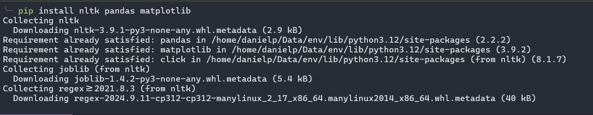
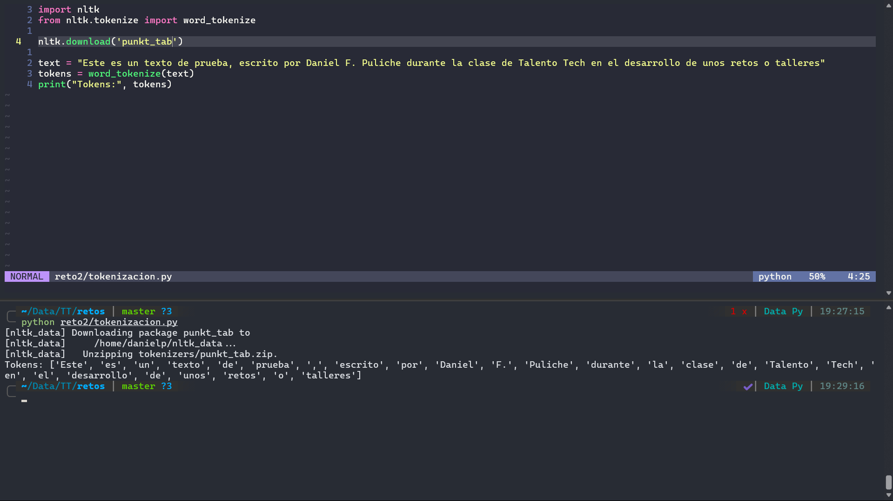
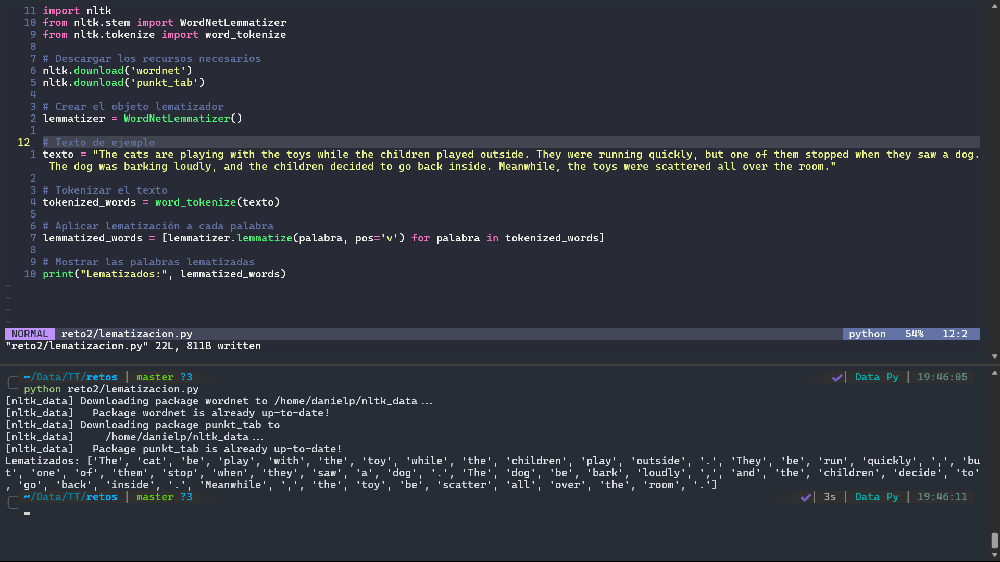
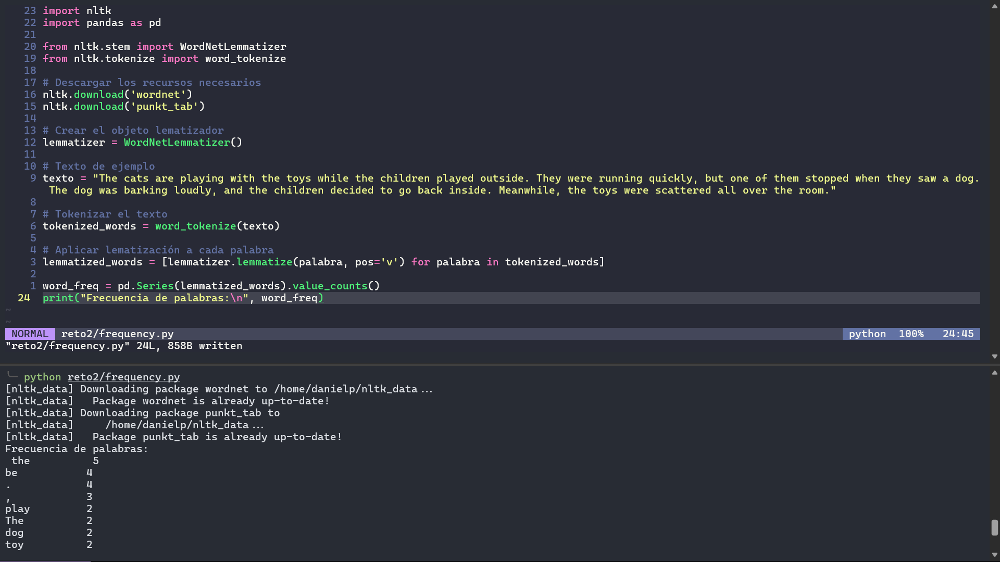
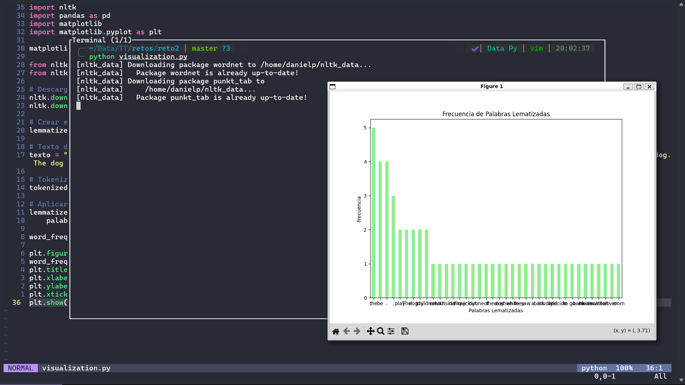

# **Taller: Laboratorio de prácticas con datos de texto** 

| Tiempo de ejecución: 2 horas |  |
| ---- | ---- |
| **PLANTEAMIENTO DE LA SESIÓN**  | **Materiales** |
| El taller de análisis de textos se estructura en dos partes. En la primera hora, se llevará a cabo una sesión práctica utilizando Python como herramienta principal. Se aprenderá a realizar tareas de procesamiento de lenguaje natural, como tokenización y lematización de texto, así como el análisis de la frecuencia de palabras. Se utilizarán bibliotecas populares como NLTK y Pandas para implementar estos procesos y se realizará una visualización básica de datos utilizando Matplotlib. En la segunda hora, se abordarán aspectos teóricos del procesamiento de lenguaje natural, incluyendo conceptos avanzados como modelos de lenguaje, aprendizaje profundo en NLP y consideraciones éticas en el análisis de textos. | Conexión a Internet. |

## **Parte Práctica en Python** 

```bash
# Instalación de librerías necesarias
pip install nltk pandas matplotlib
```


### **Tokenización de Texto** 

Adicione, lo necesario para la tokenización, deberá añadir y argumento de la variable text. 

```python
import nltk
from nltk.tokenize import word_tokenize

nltk.download('punkt_tab')

text = #Adjunte el texto de su agrado 
tokens = word_tokenize(text)
print("Tokens:", tokens)
```



### **Lematización de Palabras** 

Complete el siguiente script (Nota: Este contiene partes sin rellenar) 

```python
from nltk.stem import WordNetLemmatizer

# ---

# Descargar los recursos necesarios
nltk.download('wordnet')

# ---

lemmatizer = WordNetLemmatizer()
lemmatized_words = [lemmatizer.lemmatize(palabra, pos='v') for palabra in tokenized_words]

print("Lematizados:", lemmatized_words)
```



### **Análisis de Frecuencia de Palabras** 

```python
import pandas as pd

# ---

word_freq = pd.Series(lemmatized_words).value_counts()

print("Frecuencia de palabras:\n", word_freq)
```



### **Visualización de Datos** 

Deberá analizar y completar el script para graficar

```python
import matplotlib.pyplot as plt
#Grafique la frecuencia de los datos
```



## **Parte Teórica:** 

Definir con sus propias palabras los siguientes conceptos.

### **Conceptos Fundamentales de Procesamiento de Lenguaje**   
**Natural** 

- Tokenización: Separar el texto por cada una de las palabras o simbolos especiales que la componen, en una lista ordenada de estos. 
- Lematización: Permite obtener las palabras en su forma base, sin plurales, conjugaciones y más.
- Análisis de Sentimientos: A partir de este se puede determinar el sentido o intensión con el que el escritor escribió el texto.

### **Métodos Avanzados en NLP** 

- Modelos de Lenguaje: Algoritmos o modelos matemáticos diesñóados para el manejo de lenguaje humano.
- Aprendizaje Profundo en NLP: Hacer uso de redes neuronales profundos para las tareas relacionadas con el lenguaje humano.
- Traducción Automática: Modelos que permiten a partir de la identificación de patrones con ML, pueden realizar traducciones a otros idiomas en tiempo real con la cálidad adecuada.

### **Desafíos y Consideraciones Éticas** 

- Privacidad de Datos: Es de suma importancia poder brindar privacidad a los datos de las personas, ciertos datos es necesario que sea completamente privados.
- Sesgos en el Análisis de Textos: Los sesgos pueden llegar a distorsionar los resultados en el campo de NLP, es importante identificar los tipos de sesgos existentes y las opciones para mitigar estos sesgos.

### **Aplicaciones Prácticas de NLP** 

- Motores de Búsqueda: Permite a los motores de busqueda ser más precisos con los resultados que muestran.
- Asistentes Virtuales: A partir de las diferentes formas y maneras de expresar ordenes, el asistente con NLP puede interpretarlas y llevarlas a cabo exitosamente.
- Sistemas de Recomendación: A partir de lo escrito o dicho por el usuario, estos sistemas pueden identificar que le puede gustar al usuario y de esta forma darle recomendaciones más acordes a él.

Lo anterior permite profundizar en el análisis de textos.